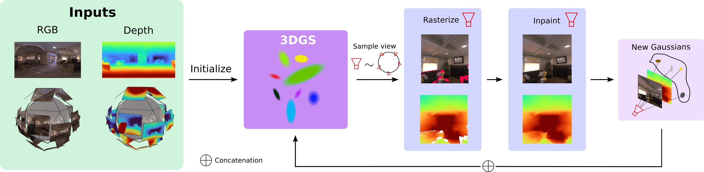

# 360 3D Photos
### [Paper](https://manurare.github.io/3603dphoto/paper.pdf) | [Project Page](https://manurare.github.io/3603dphoto/)

This is the official code for
*360° 3D Photos from a Single 360° Input Image*

 [Manuel Rey Area](https://manurare.github.io/),
 [Christian Richardt](https://richardt.name/) <br>
 University of Bath, Meta Reality Labs

 __IEEE VR 2025__



### Setup
After cloning repo, update submodules
```
git submodule update --init --recursive
```

We recomment running this code inside a coda environment

```
conda env create -f environment.yml
conda activate 3603dphoto
pip install submodules/diff-gaussian-rasterization
pip install submodules/simple-knn
```

Follow the installation steps for [360monodepth](https://github.com/manurare/360monodepth). Add the following line: `return estimated_depthmap, erp_rgb_image_data` [here](https://github.com/manurare/360monodepth/blob/5c053f2285466cb884d148dc54489ec654327668/code/python/src/main.py#L490) 

### Train
The intialization stage can be run as following:

```
python train.py -s path/to/input_rgb.jpg -m exp1 --random_background --eval --sh_degree 0 --iterations 7000
```
**Note**: if ground-truth depth is available, provide the file with `--ground-truth path/to/gt_depth.dpt`

Next, the scene completion stage is run as:

```
python pipeline.py --eval -m exp1 --start_iteration 7000 --fill_strategy SDInp --sh_degree 0 --random_background --xp_name virtual
```

### Test
To render a lemniscate camera trajectory:

```
python render.py --eval -m exp1/virtual --lradius 0.5 --pathc lemniscate
```

Finally, to evaluate the renderings quality:

```
python metrics.py -m exp1/virtual
```